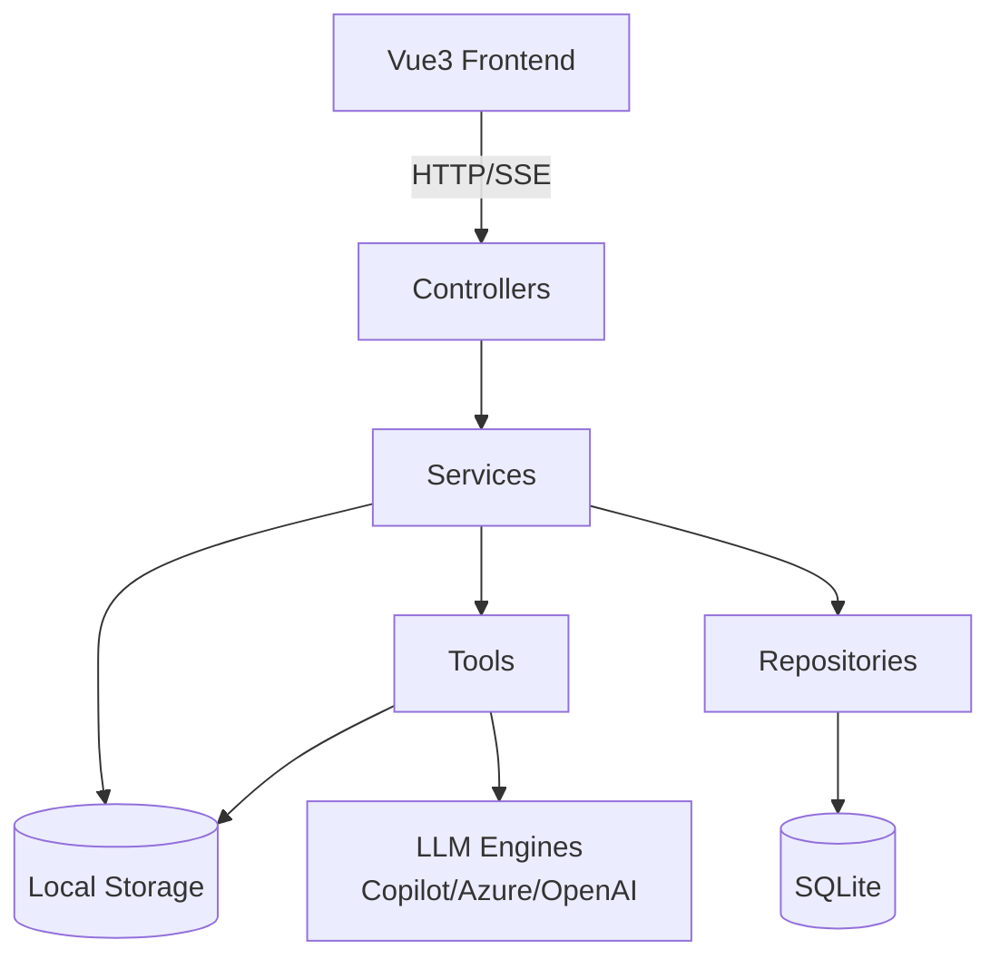
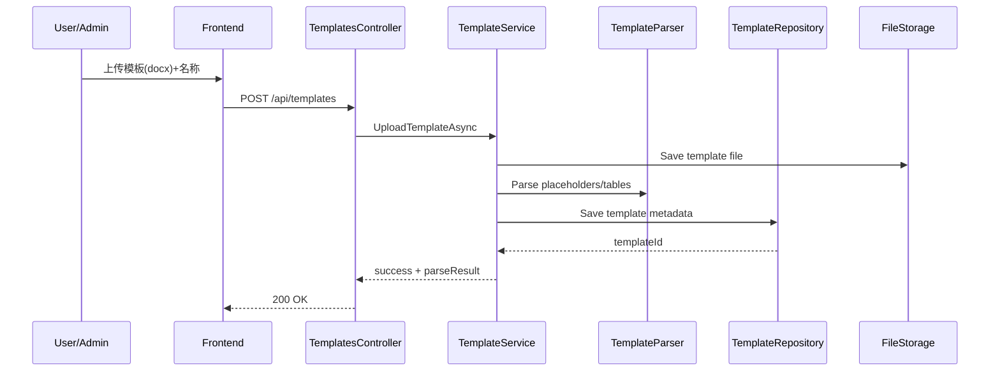
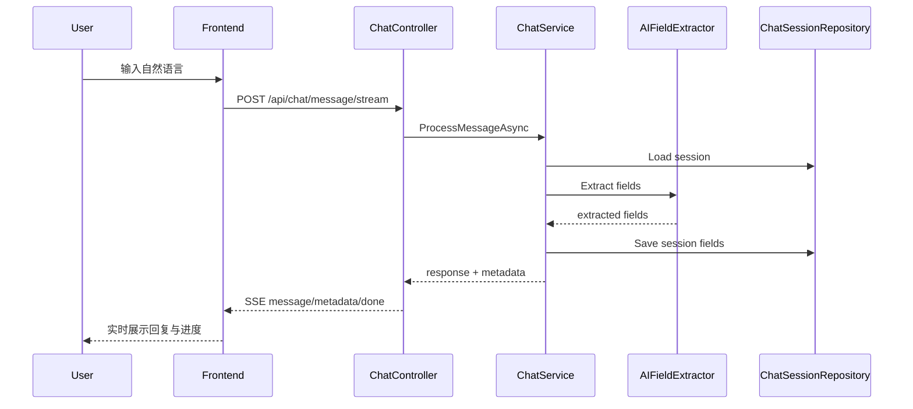
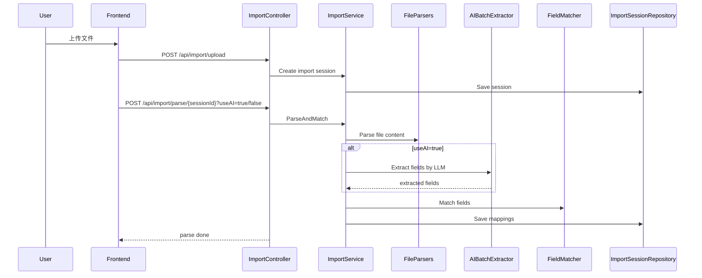

# 系统架构设计（04_arch）

> 项目：通用 Word 智能填充 Agent  
> 版本：MVP / W8 阶段  
> 更新时间：2026-05-14

## 1. 架构目标

- 以“模板驱动”方式统一文档生成流程，降低手工编辑成本。
- 提供三条输入路径：手工填报、对话填报、文件导入填报。
- 在本地可运行、可调试、可验收，优先保证可用性与可扩展性。

## 2. 总体架构

```text
[Vue3 前端]
    |
    | HTTP / SSE
    v
[ASP.NET Core Web API]
    |
    +-- Controllers（API 边界层）
    |     - TemplatesController
    |     - GenerateController
    |     - ChatController
    |     - ImportController
    |
    +-- Services（业务编排层）
    |     - TemplateService
    |     - GenerateService
    |     - ChatService
    |     - ImportService
    |     - AIService / MultiEngineLLMService
    |
    +-- Tools（能力组件层）
    |     - TemplateParser
    |     - DocGenerator
    |     - DataValidator
    |     - AIFieldExtractor / AIBatchExtractor
    |     - FieldMatcher
    |     - FileParser.*
    |
    +-- Repositories（数据访问层）
    |     - TemplateRepository
    |     - ChatSessionRepository
    |     - ImportSessionRepository
    |
    +-- Data（基础设施）
          - SQLite（业务元数据）
          - 本地文件存储（templates/uploads/output）
```

## 3. 分层职责

### 3.1 前端层（frontend）

- 提供模板管理、字段确认、导入匹配、文档下载等页面。
- 通过 REST API 与后端交互。
- 在聊天场景中通过 SSE 接收流式输出。

### 3.2 API 层（Controllers）

- 统一处理输入校验与 HTTP 状态码返回。
- 不承载复杂业务规则，业务逻辑下沉到 Service。
- 关键路由前缀：
  - `/api/templates`
  - `/api/generate`
  - `/api/chat`
  - `/api/import`

### 3.3 业务层（Services）

- `TemplateService`：模板上传、字段解析、启停状态管理。
- `GenerateService`：字段校验、模板渲染、输出文档生成。
- `ChatService`：会话生命周期、AI 抽取、引导话术、进度计算。
- `ImportService`：多格式解析、字段匹配、人工修正、生成落地。

### 3.4 能力层（Tools）

- 解析能力：Word/Excel/JSON/PDF/文本/图片 OCR。
- 生成能力：Word 占位符与表格数据注入。
- AI 能力：字段抽取、批量抽取、多引擎回退。
- 质量能力：字段类型验证、置信度匹配。

### 3.5 持久化层（SQLite + 文件系统）

- SQLite：模板元数据、字段定义、会话状态、字段映射。
- 文件系统：
  - `storage/templates` 模板文件
  - `storage/uploads` 导入文件
  - `storage/output` 输出文档

## 4. 核心业务流程

### 4.1 模板上传与解析

1. 客户端上传 Word 模板与名称。
2. `TemplateService` 调用 `TemplateParser` 抽取字段/表格定义。
3. 元数据写入 SQLite，模板文件保存到 `storage/templates`。

### 4.2 直接生成（无会话）

1. 客户端提交 `templateId + fields + tables`。
2. `GenerateService` 完成模板存在性与字段合法性校验。
3. `DocGenerator` 渲染并生成 docx。
4. 返回下载地址 `/api/generate/download/{fileName}`。

### 4.3 对话填充（Chat）

1. 调用 `/api/chat/start` 创建会话。
2. 用户通过 `/api/chat/message` 或 `/api/chat/message/stream` 输入信息。
3. `ChatService` 调用 `AIFieldExtractor` 抽取字段并验证。
4. 会话状态持续更新，达到完成条件后可进入生成。

### 4.4 导入填充（Import）

1. 上传导入文件并创建 `ImportSession`。
2. 规则解析或 AI 解析并匹配模板字段。
3. 用户可手工修正映射关系。
4. 调用生成接口输出最终文档。

## 5. 运行与部署视角

- 后端：ASP.NET Core（默认 `http://localhost:5000`）。
- 前端：Vite 开发服务器（默认 `http://localhost:5173`）。
- CORS：仅放行 `http://localhost:5173`。
- API 文档：开发环境启用 Swagger。
- 日志：Serilog 输出到控制台与 `backend/FrameAgentWordFill/logs/`。

## 6. 可靠性与扩展点

### 6.1 可靠性策略

- 输入前置校验（空值、模板存在性、字段合法性）。
- AI 解析失败时回退规则解析路径（Import 场景）。
- 错误统一写日志并返回可读信息。

### 6.2 扩展建议

- 认证鉴权：增加 JWT / Entra ID，区分管理员与普通用户能力。
- 存储演进：SQLite/本地文件可替换为云存储与托管数据库。
- 异步任务：大文件解析与批量生成可改造成后台任务队列。
- 观测增强：补充指标监控、链路追踪和错误告警。

## 7. 当前约束（MVP）

- 主要面向单机/小规模并发验证。
- 接口响应模型已相对稳定，但尚未版本化。
- 文档生成能力聚焦 docx，后续可扩展 PDF 导出链路。

## 8. 模块依赖图（验收视角）



依赖约束：

- 前端只访问 API 层，不直接访问数据库或文件系统。
- Controller 不直接访问 Repository，仅通过 Service 编排。
- Repository 仅负责数据访问，不包含业务规则。
- Tool 不持有业务状态，作为可复用能力组件。

## 9. 关键时序图（验收主链路）

### 9.1 模板上传与解析时序



### 9.2 对话填充时序（含 SSE）



### 9.3 导入填充时序（AI/规则双路径）



## 10. 架构验收清单（DoD）

- API 分层符合依赖约束（Controller -> Service -> Repository/Tool）。
- 三条主链路均可端到端跑通并返回可用结果。
- 文件、数据库、日志路径在本地环境一致且可追踪。
- 导入 AI 路径失败时可回退规则路径，不阻塞主流程。
- 前端在对话链路可稳定消费 SSE 事件（message/metadata/done）。
